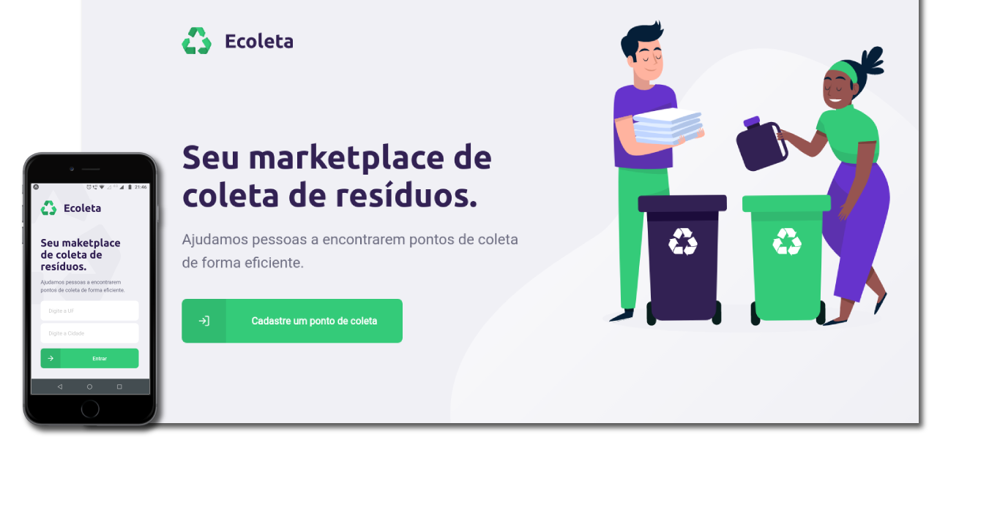

<h1 align="center">
    
</h1>

<h4 align="center">
   NextLevelWeek 1.0
</h4>

<p align="center">
  

  
  
  <a href="https://github.com/LeandroSantosGit/Ecoleta/commits/master">
    
  </a>

  <a href="https://github.com/LeandroSantosGit/Ecoleta/issues">
    
  </a>
  
</p>

<p align="center">
  <a href="#-Projeto">💻 Projeto</a>&nbsp;&nbsp;&nbsp;|&nbsp;&nbsp;&nbsp;
  <a href="#rocket-tecnologias"> :rocket: Tecnologias</a>&nbsp;&nbsp;&nbsp;|&nbsp;&nbsp;&nbsp;
  <a href="#-layout"> 🔖 Layout</a>&nbsp;&nbsp;&nbsp;|&nbsp;&nbsp;&nbsp;
  <a href="#gear-instalação"> :gear: Instalação</a>&nbsp;&nbsp;&nbsp;
  <a href="#-como-contribuir">🤔 Como Contribuir</a>&nbsp;&nbsp;&nbsp;|&nbsp;&nbsp;&nbsp;
  <a href="#memo-licença"> :memo: Licença</a>&nbsp;&nbsp;&nbsp;|&nbsp;&nbsp;&nbsp;
  <a href="#mailbox_with_mail"> :mailbox_with_mail: Entrar em Contato</a>
</p>

<p align="center">
  
</p>


## 💻 Projeto

O Ecoleta é um projeto de coleta seletiva desenvolvido na semana do *Dia Mundial do Meio Ambiente*, que visa contribuir para empresas, catadores, ONG's e sociedade a proteger o meio ambiente.

O projeto tem como objetivo divulgar e tornar visível pontos de coleta, sendo acessível por meio de web e aplicativo de celular, facilitando o cadastro de pontos de entrega voluntária (PEVs), pontos de coleta, galpões e associação de catadores, que podem ser contactados por email e whatsapp de forma acessível e ágil.

Em concordância com a Política Nacional de Resíduos Sólidos, podemos colher bons frutos desta relação bem sucedida no objetivo de inserir profissionais no mercado e na prestação de serviços à população.

Desenvolvido na semana do NextLevelWeek 1.0 da [Rocketseat](https://rocketseat.com.br/).


## :rocket: Tecnologias

Esse projeto foi desenvolvido com as seguintes tecnologias:

- [Node.js](https://nodejs.org/en/)
- [React](https://reactjs.org)
- [React-Native](https://facebook.github.io/react-native/)
- [TypeScript](https://github.com/microsoft/TypeScript)
- [Expo](https://expo.io/)
- [Express](https://expressjs.com/pt-br/)
- [Axios](https://www.npmjs.com/package/axios)
- [Cors](https://github.com/expressjs/cors)
- [knex](http://knexjs.org/)
- [Celebrate](https://github.com/arb/celebrate)

## 🔖 Layout

Você pode visualizar o layout do projeto no formato através [desse link](https://www.figma.com/file/9TlOcj6l7D05fZhU12xWT3/Ecoleta-(Booster)?node-id=0%3A1). Lembrando que você irá precisar ter uma conta no [Figma](http://figma.com/).

## :gear: Instalação

Para executar a aplicação é necessário ter instalado as ferramentas a baixo:

* [Npm](https://www.npmjs.com/package/npm/v/6.13.4  "Clique para abrir a página de instalação") na versão `^6.13.4`

* [Node.js](https://nodejs.org/ru/download/releases/  "Clique para abrir a página de instalação") na versão `^12.16.1`

* [Expo-cli](https://docs.expo.io/versions/v36.0.0/get-started/installation/ "Clique para abrir a página de instalação") na versão `~36.16.1`

#### Backend

Abra o terminal e navegue até o diretório `backend`, e baixe as dependencias da aplicação executando os comados a baixo:
```
$npm install
```
Em seguida crie o banco de dados `SQLite` com os comandos a baixo:
```
$npm run knex:migrate
$npm run knex:seed
```
Em seguida execute o servidor `Express` com o comando a baixo:
```
$npm run dev
```

#### Web

Abra o terminal e navegue até o diretório `web`, e baixe as dependencias da aplicação executando os comados a baixo:
```
$npm install
```
Em seguida execute o `ReactJS` com o comando a baixo:
```
$npm start
```

Automaticamente será aberta aplicação web no seu navegador em `localhost:3333`.

#### Mobile

Abra o terminal e navegue até o diretório `mobile`, e baixe as dependencias da aplicação executando os comados a baixo:
```
$npm install
```

Em seguida execute o `expo` com o comando a baixo:
```
$npm start
```

Automaticamente será aberta no seu navegador a página `localhost:19002`. Conecte no emulador, ou teste o aplicativo por LAN: baixe o aplicativo Expo da Play Store ou App Store e em seguida escaneie o código QR. Está aplicação foi executado em um dispositivo Android Versão 6.0.1.

Abra a diretório `src/services` e coloque o endereço do seu servidor expo, no arquivo `api.js` altere a `baseURL` com o número IPV4 da sua conexão com a porta 3333. Exemplo:
```
const api = axios.create({
	baseURL:  "http://192.168.0.134:3333",
});
```
Altere também o endereço `url` no backend com seu servidor expo, para carregar as imagens no mobile, abra `backend/src/controllres`, nos arquivos `ItemsController.ts` e `PointsController.ts` altere o ip em `image_url`. Exemplo:
```
image_url: `http://novo-endereço/uploads/${item.image}`
```

## 🤔 Como contribuir

- Faça um fork desse repositório;
- Cria uma branch com a sua feature: `git checkout -b minha-feature`;
- Faça commit das suas alterações: `git commit -m 'feat: Minha nova feature'`;
- Faça push para a sua branch: `git push origin minha-feature`.

Depois que o merge da sua pull request for feito, você pode deletar a sua branch.

## :memo: Licença

Esse projeto está sob a licença MIT. Veja o arquivo [LICENSE](LICENSE.md) para mais detalhes.

## :mailbox_with_mail: Entrar em contato

<a href="https://twitter.com/rockgolmetal" target="_blank" >
  
</a>&nbsp;&nbsp;&nbsp;
<a href="https://www.linkedin.com/in/leandro-s-7811b1151/" target="_blank" >
  
</a>&nbsp;&nbsp;&nbsp;
<a href="mailto:santosdeveloper19@gmail.com" target="_blank" >
  
</a> 